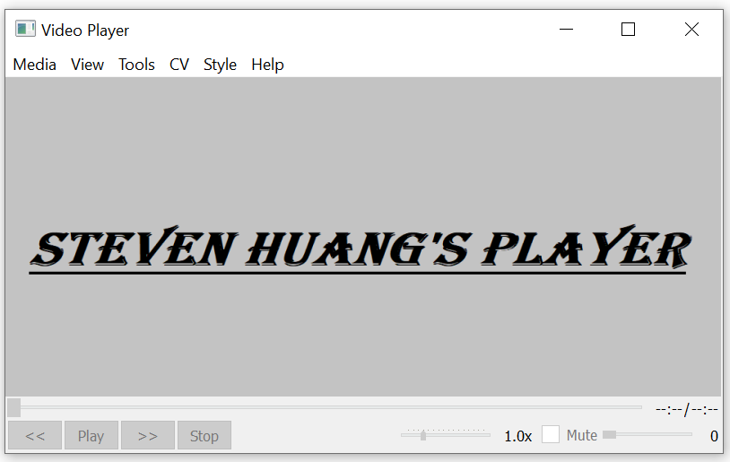

## VideoPlayer


A simple video player based on QT and FFmpeg. This is just a rough work for personal use. Any bugs or suggestions about it are welcome.

Please find the release player [here.](https://github.com/StevenHuang2020/VideoPlayer/releases)



##### Compilation
- Visual Studio 19

Please install ```QT tools extention``` in Visual Studio. If you use another version VS, please use CMake and CMakeLists.txt to generate your own VS project files.</br>

- CMake
```
cd CMakeLists.txt folder
mkdir build
cd build
cmake .. -G "Visual Studio 16 2019" -T host=x64 -A x64

//build debug version
cmake --build .

//build release version
cmake --build . --config Release
```

##### History

- v2.0.8, clickable progressbar; play speed bug fixed; added play list;
- v2.0.7, audio visualization; youtube url open options; menu updates;
- v2.0.3, play speed control; full screen
- v2.0.1, CMake configuration
- v2.0.0, added cv effects by using OpenCV;
- v1.1.8, bugs fixed;
- v1.1.6, app settings; loop play; media info;
- v1.1.5, dxva2 decode support; recent files;
- v1.1.4, play seek bug fixed;
- v1.1.2, 29/04/22
    - play start thread; progressbar; skin;
- v1.1.0, 23/04/22
    - A/V sync control
- v1.0.1, 20/04/22
    - A/V play buffer control
- v1.0.0, 16/04/22
    - initial version

##### References

 - A/V library [FFmpeg.](https://ffmpeg.org/) <br/>
 - GUI framework [QT.](https://www.qt.io/)
 - QT skins [github.](https://github.com/GTRONICK/QSS)
 - Youtube stream-media url [youtube-dl.](https://youtube-dl.org/)
 - [OpenCV](https://opencv.org/)
